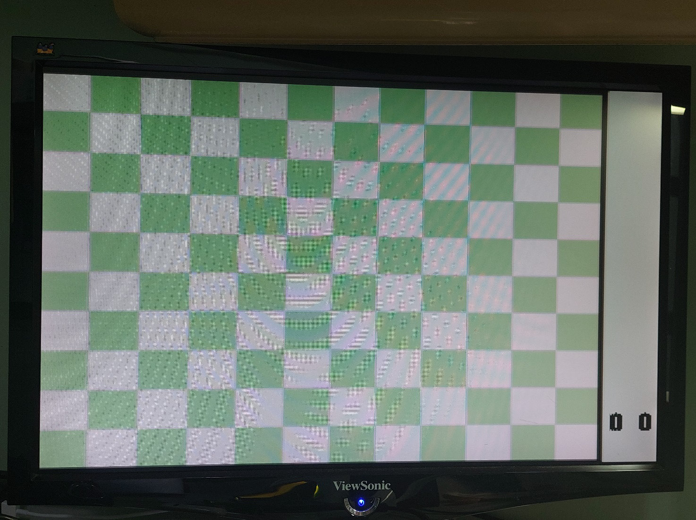
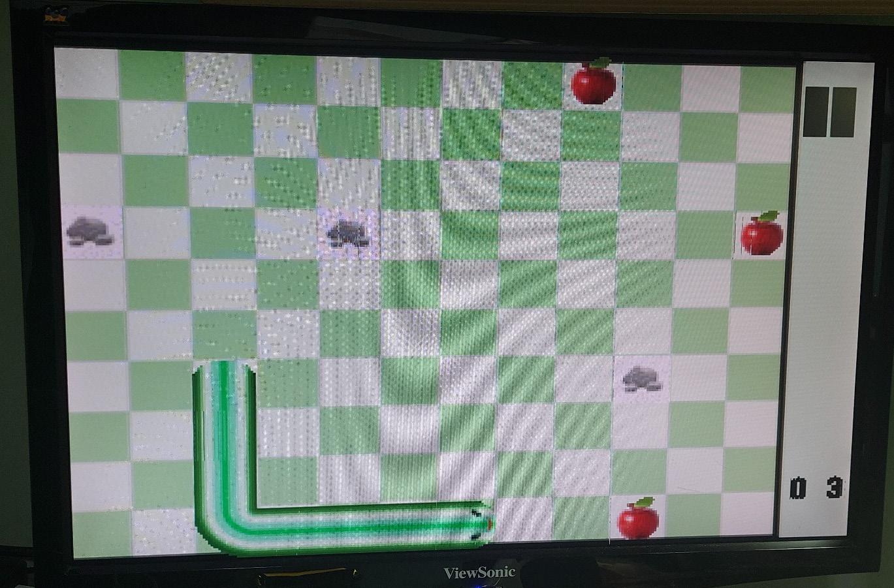
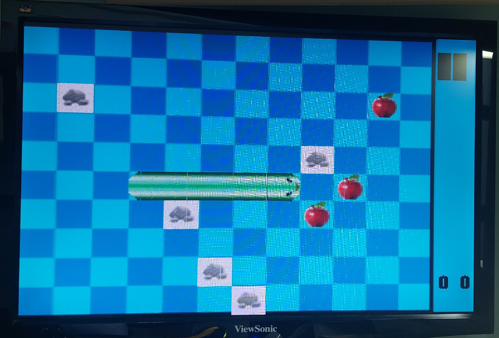
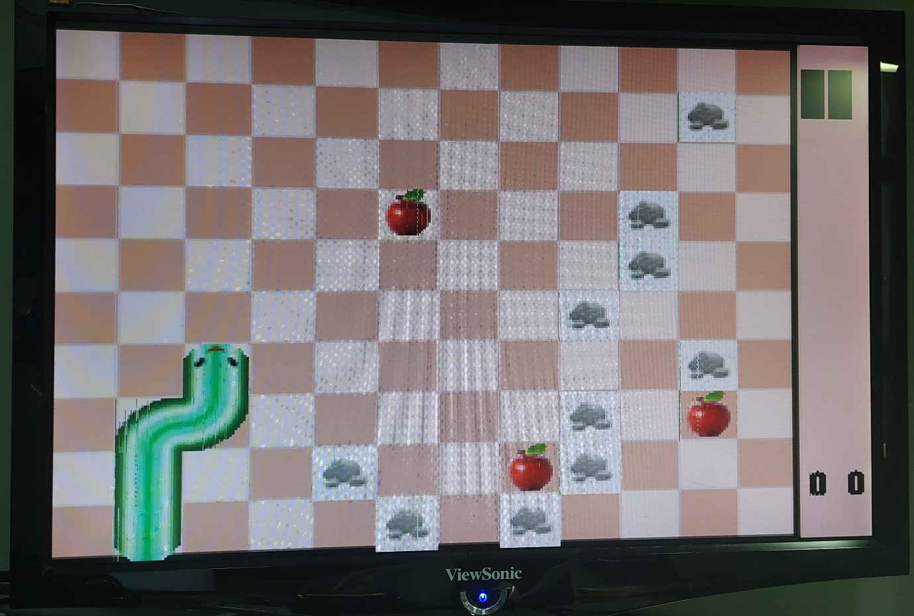
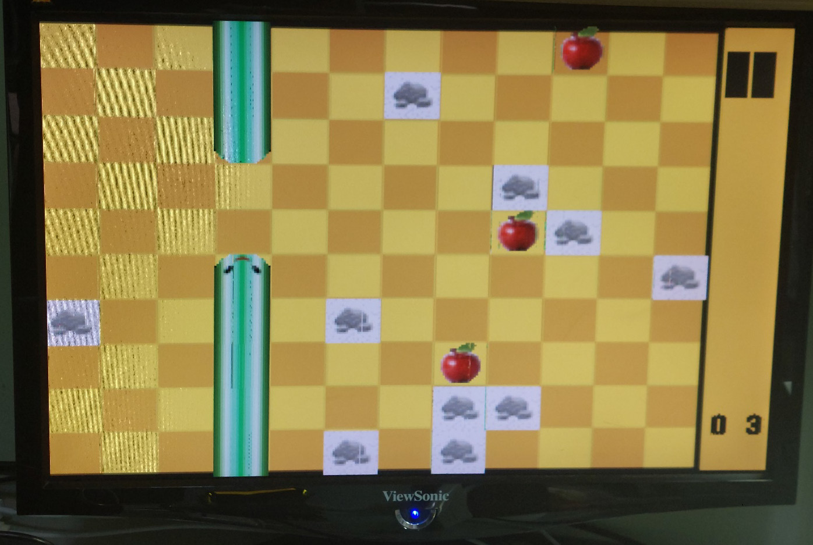
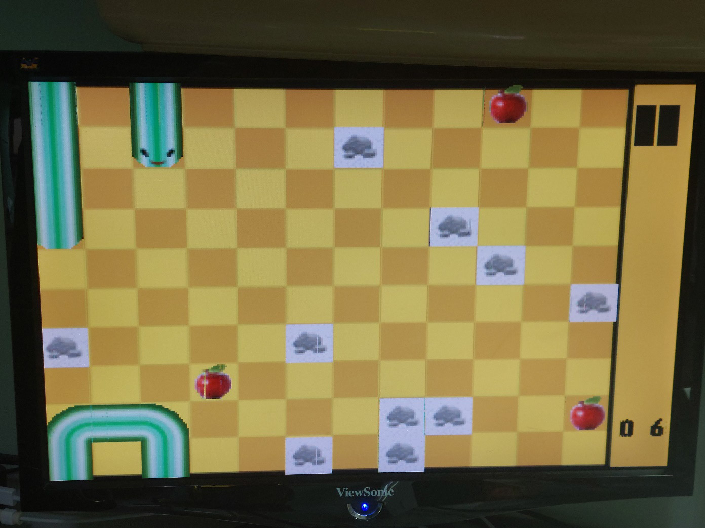
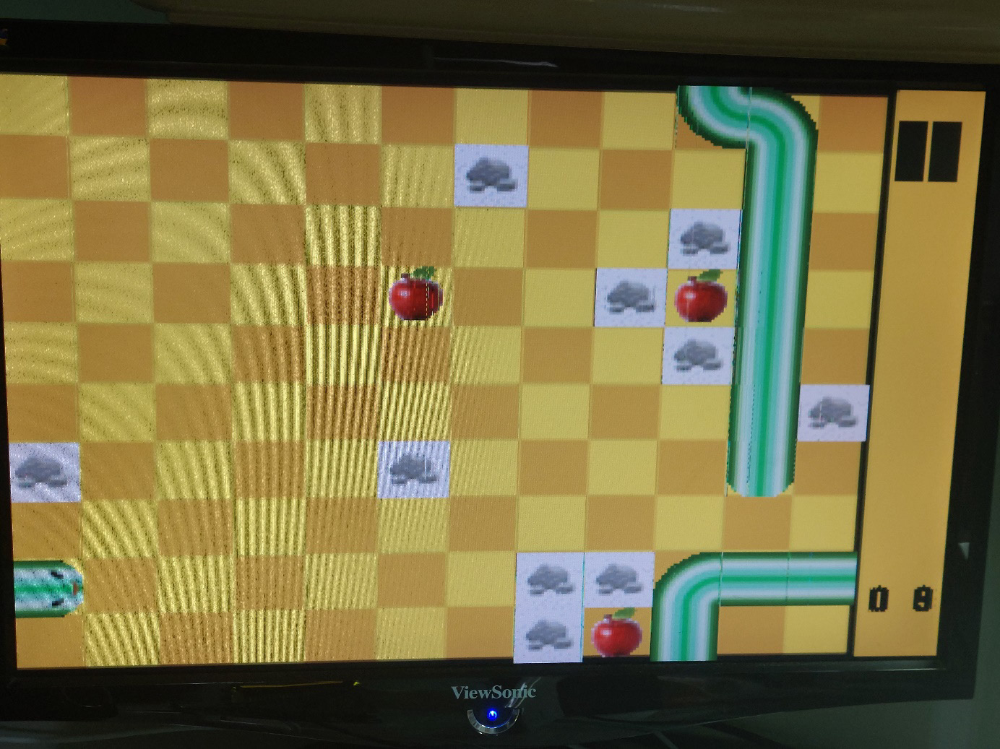
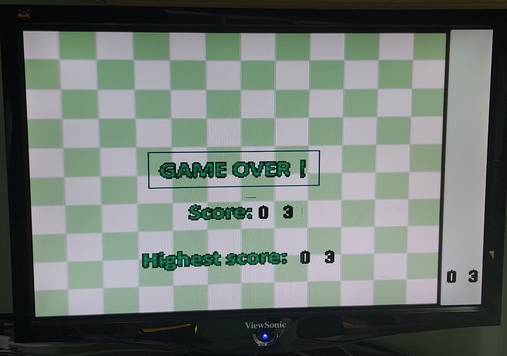
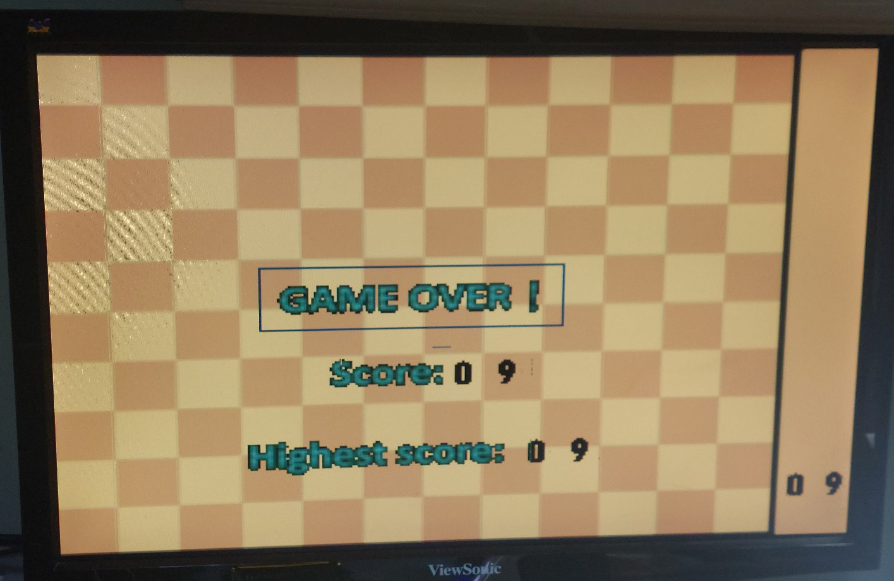

# DCL_Final

Final Project 2024

Author: Henry Chung(鍾承翰), Eric Chen(陳景寬), Dozen Zhou(周琨棋)

Topic: Snake 貪食蛇

Language: Verilog

Tools: Vscode, Vivado

---
### 簡介

貪食蛇遊戲：玩家透過按鈕選擇模式、操作蛇的移動，在躲避障礙物與牆壁的同時，盡可能想辦法吃到更多的蘋果，蛇前進的速度約為0.5秒一格。隨著時間增加蛇身會越來越長，小心也不能撞到自己！
遊戲分為四種模式，提供玩家選擇，也會記錄玩家遊玩的最高分數。以下為一些遊戲畫面。

### 操作說明

一開始進入選擇模式階段：可以透過按鈕選擇四種模式：
- btn3：困難模式 (10個障礙物/吃五個蘋果加1分/撞到一次障礙物扣1分)
- btn2：中等模式 (5個障礙物/吃四個蘋果加1分/撞到兩次帳礙物扣1分)
- btn1：簡單模式 (3個障礙物/吃三個蘋果加1分/10格內撞到2次障礙物扣1分)
- btn0：無邊際模式 (10個障礙物/吃兩個蘋果加1分/撞到邊界不會死，會從另外一邊出來/撞到一次障礙物扣1分)

選擇完成之後**切換sw0**即可開始遊玩：透過按鈕轉彎：
- btn3：向上
- btn2：向下
- btn1：向左
- btn0：向右

在遊戲中可以透過**切換 sw1** 來暫停遊戲

### 功能說明

*基本功能*：
- 繪製一條長度為5單位的蛇，蛇可以移動。
- 蛇可以彎曲、轉彎。
- 提供蛇可以吃的食物，並生成一些障礙物。
- 蛇可以吃食物但不會改變身體長度。
- 遊戲場景有邊界。
- 使用按鈕或開關來控制互動。
   
*進階功能*：
- 計分系統
- 蛇的長度隨分數增長  
- 當蛇碰到障礙物的時候，分數減少；當分數為零的時候，遊戲結束  
- 不同模式有不同的場景  

*額外功能*：
- 隨時顯示即時分數，紀錄歷史高分  
- GAMEOVER 結算畫面，VGA顯示分數與歷史高分  
- 隨機生成蘋果與障礙物
- 不同玩法(無邊際模式)
- 不同模式有不同的難度
- 背景顏色更換
- 蛇撞到障礙物時有特效警告
- 遊戲暫停鍵(切換sw1可以暫停遊戲)  

### 組員分工
陳景寬：VGA display(screen.v)、圖片處理  
周琨棋：check.v(控制蛇動作、計分)  
鍾承翰：main Function(lab8.v)、整合檔案、模式選擇、蘋果及障礙物隨機生成、debug

--- 
### 遊戲畫面

